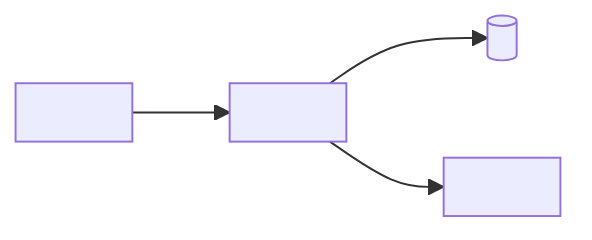

<!--
  ENTERPRISE README TEMPLATE
  ==========================
  Copy this file to your project root as README.md, then work top to bottom.

  Two conventions govern this file:

  1. PLACEHOLDERS are <SCREAMING_SNAKE_CASE> in angle brackets. Replace every one.
     The completion check is a single command:

         grep -n '<[A-Z][A-Z0-9_]*>' README.md      # must return nothing

  2. MARKERS in HTML comments say whether a section applies to you:

         <!-- REQUIRED-IF: ... -->  keep when the condition holds, else delete
                                    the whole section
         <!-- OPTIONAL: ... -->     judgement call; default to deleting
         <!-- GUIDANCE: ... -->     what belongs here and what does not;
                                    always delete before publishing

     No section is silently optional. A section with no marker is required, so a
     reviewer can tell a deliberate omission from an oversight.

  Delete this comment block once you are done.
-->

# <PROJECT_NAME>

<!-- GUIDANCE: One sentence. What this is and who it is for — not how it works.
     A reader who knows nothing should be able to decide from this line alone
     whether the rest of the page is relevant to them. -->

<ONE_SENTENCE_DESCRIPTION>

[](<BUILD_URL>)
[](<COVERAGE_URL>)
[](<RELEASES_URL>)
[](LICENSE)

## Status and ownership

<!-- GUIDANCE: Keep this near the top. It is the first thing an internal reviewer,
     an on-call engineer, or a team considering a dependency looks for. Every
     field must resolve to a real person, team, or link — never "TBD". -->

| | |
|---|---|
| **Maturity** | <ALPHA / BETA / GENERALLY_AVAILABLE / MAINTENANCE / DEPRECATED> |
| **Owning team** | <TEAM_NAME> |
| **Contact** | <SLACK_CHANNEL_OR_MAILING_LIST> |
| **On-call** | <ON_CALL_ROTA_URL> |
| **Source of record** | <REPOSITORY_URL> |
| **Issue tracker** | <TRACKER_URL> |

<!-- REQUIRED-IF: maturity is DEPRECATED. Delete otherwise. -->
> [!WARNING]
> **Deprecated.** <REPLACEMENT_OR_MIGRATION_PATH>. Support ends <END_OF_SUPPORT_DATE>.

## Contents

- [Overview](#overview)
- [Architecture](#architecture)
- [Getting started](#getting-started)
- [Configuration](#configuration)
- [Usage](#usage)
- [Development](#development)
- [Testing](#testing)
- [Build and deployment](#build-and-deployment)
- [Observability](#observability)
- [Security](#security)
- [Compliance and data handling](#compliance-and-data-handling)
- [Service levels and support](#service-levels-and-support)
- [Versioning and compatibility](#versioning-and-compatibility)
- [Governance](#governance)
- [Roadmap](#roadmap)
- [Contributing](#contributing)

## Overview

<!-- GUIDANCE: Two or three paragraphs at most. Lead with the problem, not the
     solution — a reader who does not have the problem should stop here. -->

<PROBLEM_THIS_SOLVES>

### Capabilities

- <CAPABILITY_1>
- <CAPABILITY_2>
- <CAPABILITY_3>

### Non-goals

<!-- GUIDANCE: The section most often missing and most often needed. State what
     this deliberately does not do, so nobody proposes it, files a bug about it,
     or builds on an assumption you never made. -->

- <NON_GOAL_1> — <WHY_OUT_OF_SCOPE>
- <NON_GOAL_2> — <WHY_OUT_OF_SCOPE>

## Architecture

<!-- GUIDANCE: A diagram in Mermaid rather than an image file — GitHub renders it
     natively, and it lives in version control next to the code it describes, so
     it cannot silently drift out of date the way an exported PNG does.
     Show the boundaries and the data flow. Do not show every class. -->



### Components

| Component | Responsibility | Location |
|---|---|---|
| <COMPONENT_1> | <WHAT_IT_OWNS> | [`<PATH_1>`](<PATH_1>) |
| <COMPONENT_2> | <WHAT_IT_OWNS> | [`<PATH_2>`](<PATH_2>) |

### External dependencies

<!-- GUIDANCE: Criticality answers one question: if this dependency is down, what
     happens to us? Use Critical (we are down), Degraded (we lose a feature), or
     Optional (no user-visible effect). -->

| Dependency | Purpose | Criticality | Owner |
|---|---|---|---|
| <DEPENDENCY_1> | <WHY_WE_CALL_IT> | <CRITICAL / DEGRADED / OPTIONAL> | <OWNING_TEAM_1> |

## Getting started

### Prerequisites

<!-- GUIDANCE: Pin versions. "Node" is not a prerequisite; "Node 20.x" is. -->

| Requirement | Version | Notes |
|---|---|---|
| <RUNTIME> | <VERSION_CONSTRAINT> | <NOTE> |
| <BUILD_TOOL> | <VERSION_CONSTRAINT> | <NOTE> |
| <ACCESS_OR_CREDENTIAL> | — | <HOW_TO_REQUEST_IT> |

### Install

```bash
git clone <REPOSITORY_URL>
cd <PROJECT_DIRECTORY>
<INSTALL_COMMAND>
```

### Configure

```bash
cp .env.example .env
# Fill in the required values — see Configuration below.
```

### Run

```bash
<RUN_COMMAND>
```

### Verify

<!-- GUIDANCE: A command whose output proves the setup worked, plus the output
     itself. Without this, a reader who mis-configured something does not find
     out until much later, in a more confusing place. -->

```bash
<VERIFY_COMMAND>
```

Expected output:

```
<EXPECTED_OUTPUT>
```

## Configuration

<!-- GUIDANCE: Every setting the software reads, in one table. The Secret column
     is what makes this an operational document rather than a developer note:
     anything marked yes must come from <SECRET_MANAGER> and must never appear in
     a committed file, a log line, or an error message. -->

| Name | Type | Default | Required | Secret | Description |
|---|---|---|---|---|---|
| `<ENV_VAR_1>` | string | — | yes | no | <WHAT_IT_CONTROLS> |
| `<ENV_VAR_2>` | integer | `<DEFAULT>` | no | no | <WHAT_IT_CONTROLS> |
| `<ENV_VAR_3>` | string | — | yes | **yes** | <WHAT_IT_CONTROLS> |

Precedence: <PRECEDENCE_ORDER, e.g. command-line flags > environment variables > config file > defaults>.

Secrets are held in <SECRET_MANAGER> and injected at <INJECTION_POINT>. Request
access through <ACCESS_REQUEST_PROCESS>.

## Usage

<!-- GUIDANCE: Show the two or three things people actually do, as runnable
     examples with real-looking values. Link to generated reference documentation
     rather than restating it here — a hand-maintained API listing in a README is
     wrong within a month. -->

<USAGE_EXAMPLE_DESCRIPTION>

```<LANGUAGE>
<USAGE_EXAMPLE>
```

Full reference: <API_REFERENCE_URL>.

## Development

### Layout

```
<PROJECT_DIRECTORY>/
├── <DIR_1>/          <WHAT_LIVES_HERE>
├── <DIR_2>/          <WHAT_LIVES_HERE>
└── <DIR_3>/          <WHAT_LIVES_HERE>
```

### Standards

| | |
|---|---|
| **Style and lint** | <LINTER_AND_FORMATTER>, enforced by <PRE_COMMIT_OR_CI> |
| **Commits** | <COMMIT_CONVENTION, e.g. Conventional Commits> |
| **Branching** | <BRANCHING_MODEL> |
| **Review** | See [CONTRIBUTING.md](CONTRIBUTING.md) |

### Local loop

```bash
<LINT_COMMAND>
<TEST_COMMAND>
```

## Testing

| Tier | Scope | Command | Where it runs |
|---|---|---|---|
| Unit | <UNIT_SCOPE> | `<UNIT_TEST_COMMAND>` | pre-commit, CI |
| Integration | <INTEGRATION_SCOPE> | `<INTEGRATION_TEST_COMMAND>` | CI |
| End-to-end | <E2E_SCOPE> | `<E2E_TEST_COMMAND>` | <E2E_TRIGGER> |

Coverage floor is **<COVERAGE_THRESHOLD>%**, enforced in <WHERE_ENFORCED>. Builds
below it fail rather than warn.

<!-- REQUIRED-IF: this project is deployed anywhere. Delete for libraries that are
     only published to a package registry — cover that under Versioning instead. -->
## Build and deployment

### Environments

| Environment | URL | Deployed from | Trigger | Approval |
|---|---|---|---|---|
| Development | <DEV_URL> | `<DEV_BRANCH>` | automatic on merge | none |
| Staging | <STAGING_URL> | `<STAGING_BRANCH>` | <STAGING_TRIGGER> | <STAGING_APPROVER> |
| Production | <PROD_URL> | <PROD_SOURCE, e.g. tagged release> | <PROD_TRIGGER> | <PROD_APPROVER> |

### Release

1. <RELEASE_STEP_1>
2. <RELEASE_STEP_2>
3. <RELEASE_STEP_3>

### Rollback

<!-- GUIDANCE: Write this for someone reading it at 3am, under pressure, who has
     never deployed this service. Exact commands. Include how long it takes and
     what is lost — an incident is the wrong moment to discover that rolling back
     the code does not roll back a migration. -->

```bash
<ROLLBACK_COMMAND>
```

Time to recover: <ROLLBACK_DURATION>. Irreversible effects: <IRREVERSIBLE_EFFECTS, e.g. forward-only database migrations>.

<!-- OPTIONAL: only if the project uses feature flags. -->
### Feature flags

| Flag | Purpose | Default | Owner |
|---|---|---|---|
| `<FLAG_NAME>` | <WHAT_IT_GATES> | <DEFAULT_STATE> | <FLAG_OWNER> |

<!-- REQUIRED-IF: this is a long-running service. Delete for libraries and CLIs. -->
## Observability

| Signal | Where | Link |
|---|---|---|
| Logs | <LOG_PLATFORM> | <LOG_QUERY_URL> |
| Metrics | <METRICS_PLATFORM> | <DASHBOARD_URL> |
| Traces | <TRACING_PLATFORM> | <TRACE_URL> |
| Alerts | <ALERTING_PLATFORM> | <ALERT_RULES_URL> |

Runbooks: <RUNBOOK_INDEX_URL>. Every alert links to the runbook for that alert; an
alert without one is a bug.

Health endpoints: `<HEALTH_ENDPOINT>` (liveness), `<READINESS_ENDPOINT>` (readiness).

## Security

<!-- GUIDANCE: This section describes the security posture. It does not describe
     how to report a vulnerability — that belongs in SECURITY.md, where reporters
     and automated tooling look for it. Link, do not duplicate. -->

To report a vulnerability, see [SECURITY.md](SECURITY.md). **Do not open a public
issue for a security problem.**

| | |
|---|---|
| **Authentication** | <AUTHN_MECHANISM> |
| **Authorization** | <AUTHZ_MODEL> |
| **Transport** | <TLS_POSTURE> |
| **Secrets** | <SECRET_MANAGER>; rotated <ROTATION_CADENCE> |
| **Data at rest** | <ENCRYPTION_AT_REST> |
| **Dependency scanning** | <SCA_TOOL>, <SCAN_CADENCE> |
| **Static analysis** | <SAST_TOOL>, on every pull request |
| **Data classification** | <PUBLIC / INTERNAL / CONFIDENTIAL / RESTRICTED> |

Known accepted risks: <ACCEPTED_RISKS_OR_NONE>.

<!-- REQUIRED-IF: the system stores, processes, or transmits personal data, payment
     data, or health data, or falls under any audited regime. Delete otherwise —
     but read the condition twice before deciding it does not apply. -->
## Compliance and data handling

| | |
|---|---|
| **Regimes** | <GDPR / SOC_2 / HIPAA / PCI_DSS / OTHER> |
| **Data categories** | <CATEGORIES_OF_PERSONAL_DATA_HELD> |
| **Lawful basis** | <LAWFUL_BASIS_OR_NA> |
| **Retention** | <RETENTION_PERIOD_AND_DELETION_MECHANISM> |
| **Residency** | <STORAGE_REGIONS> |
| **Sub-processors** | <THIRD_PARTIES_RECEIVING_DATA> |
| **Subject access / erasure** | <HOW_A_REQUEST_IS_FULFILLED> |
| **Audit logging** | <WHAT_IS_LOGGED_AND_FOR_HOW_LONG> |

Records of processing and the data protection assessment: <DPIA_OR_ROPA_LINK>.

<!-- OPTIONAL: internal platform services and anything customer-facing. Delete for
     libraries and for tools with no availability expectation. -->
## Service levels and support

| Indicator | Objective | Measured over | Dashboard |
|---|---|---|---|
| Availability | <AVAILABILITY_TARGET> | <WINDOW> | <SLO_DASHBOARD_URL> |
| Latency (p99) | <LATENCY_TARGET> | <WINDOW> | <SLO_DASHBOARD_URL> |
| <CUSTOM_SLI> | <TARGET> | <WINDOW> | <SLO_DASHBOARD_URL> |

Error budget policy: <WHAT_HAPPENS_WHEN_THE_BUDGET_IS_EXHAUSTED>.

| Severity | Definition | Response | Channel |
|---|---|---|---|
| Sev 1 | <SEV1_DEFINITION> | <SEV1_RESPONSE_TIME> | <SEV1_CHANNEL> |
| Sev 2 | <SEV2_DEFINITION> | <SEV2_RESPONSE_TIME> | <SEV2_CHANNEL> |
| Sev 3 | <SEV3_DEFINITION> | <SEV3_RESPONSE_TIME> | <SEV3_CHANNEL> |

Support hours: <SUPPORT_HOURS_AND_TIMEZONE>. Escalation: <ESCALATION_PATH>.

## Versioning and compatibility

This project follows [Semantic Versioning](https://semver.org/spec/v2.0.0.html).

**The public API is** <WHAT_IS_COVERED_BY_THE_VERSION_CONTRACT>. Everything else —
<WHAT_IS_EXPLICITLY_INTERNAL> — may change in any release.

| Version line | Status | Supported until |
|---|---|---|
| <MAJOR_N>.x | Active | <DATE_OR_ONGOING> |
| <MAJOR_N_MINUS_1>.x | Security fixes only | <END_OF_SUPPORT_DATE> |

Deprecations are announced at least <DEPRECATION_NOTICE_PERIOD> before removal,
marked in code, and listed in [CHANGELOG.md](CHANGELOG.md). Breaking changes ship
only in a major release, with a migration note.

<!-- REQUIRED-IF: the project produces data artifacts, trained models, or anything
     else a result must be reproducible from. Delete otherwise. -->
### Artifact lineage

<!-- GUIDANCE: Code version alone does not reproduce a result that depends on
     data. State what pins each layer, and the one command that restores a past
     result — this is what an audit or a disputed number actually asks for. -->

| Layer | Versioned by | Answers |
|---|---|---|
| Code and configuration | <VCS_AND_CONFIG_MECHANISM> | By what procedure was this produced? |
| Data and artifacts | <DATA_VERSIONING_MECHANISM> | Which exact inputs and outputs? |
| Runs and results | <RUN_TRACKING_MECHANISM> | What happened, and how did it score? |

Restore a past result: `<REPRODUCE_COMMAND>`. Retention of artifacts:
<ARTIFACT_RETENTION>.

## Governance

| | |
|---|---|
| **Code owners** | [`CODEOWNERS`](.github/CODEOWNERS) |
| **Review requirement** | <NUMBER_OF_APPROVALS> approval(s), including a code owner |
| **Merge policy** | <MERGE_POLICY, e.g. squash, linear history, all checks green> |
| **Decision records** | [`docs/adr/`](docs/adr/) |

Architecturally significant changes need an ADR before implementation. See
[docs/adr/README.md](docs/adr/README.md) for what counts as significant.

<!-- OPTIONAL: keep only if you will maintain it. A stale roadmap is worse than
     no roadmap — it makes every other section look stale too. -->
## Roadmap

| Item | Target | Status |
|---|---|---|
| <ROADMAP_ITEM_1> | <TARGET_PERIOD> | <STATUS> |

## Contributing

Start with [CONTRIBUTING.md](CONTRIBUTING.md). Release history is in
[CHANGELOG.md](CHANGELOG.md).

## License

<LICENSE_NAME> — see [LICENSE](LICENSE).

<!-- OPTIONAL: keep only if there is something real to credit. -->
## Acknowledgements

<ACKNOWLEDGEMENTS>

---

<!--
  BEFORE YOU PUBLISH
  ==================
  [ ] `grep -n '<[A-Z][A-Z0-9_]*>' README.md` returns nothing.
  [ ] Every REQUIRED-IF and OPTIONAL section is either filled in or deleted
      entirely — heading, marker, and body.
  [ ] Every GUIDANCE comment is deleted.
  [ ] Owning team, contact, and on-call resolve to something real and current.
  [ ] Every link resolves, including the badge URLs.
  [ ] The Mermaid diagram renders (view the file on the web, not in an editor).
  [ ] The Getting started commands work on a clean machine, in order.
  [ ] The Verify step produces the output shown.
  [ ] No secret, token, internal hostname, or customer name appears anywhere.
  [ ] Delete this checklist.
-->
